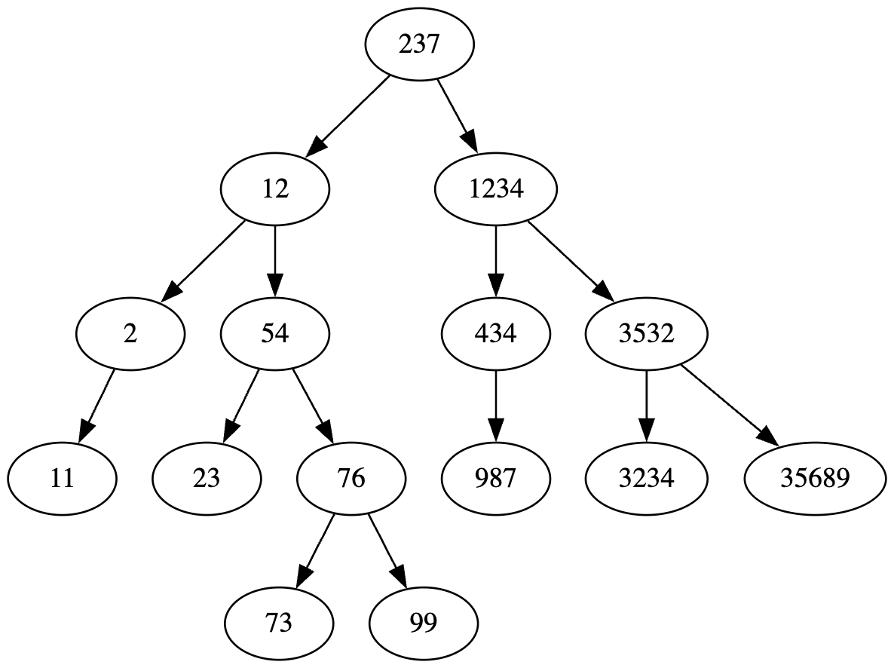

# Algorithms and classes

### .run file in the root has the config to run all tests on all datastructures

## MyArrayList
Implementation: [MyArrayList.java](../src/nl/saxion/cds/datastructures/MyArrayList.java)

### Mijn binair zoekalgoritme
Big-Oh Classificatie: O(Log(N))

**Uitleg:**  
Het binaire zoekalgoritme heeft een Big-Oh classificatie van O(Log(N)), omdat het algoritme steeds de gesorteerde array in tweeën splitst en het zoekbereik halveert.
Hierdoor wordt het zoekbereik kleiner totdat de target is gevonden.

**Implementation:**   

``` java
public int binarySearch(Comparator<V> comparator, V element) {
        int left = 0;
        int right = size - 1; 

        while (left <= right) {
            int mid = left + (right-left) / 2;
            V midElement = get(mid);

            int comparison = comparator.compare(midElement, element);

            if (comparison == 0) {
                return mid; 
            } else if (comparison < 0) {
                left = mid + 1; 
            } else {
                right = mid - 1; 
            }
        }
        return SaxSearchable.NOT_FOUND;
    }
```
In `MyArrayList` is `binarySearch()` recursief geïmplementeerd. Dit werkt alleen als de lijst al gesorteerd is en zoekt steeds het middelste element en vergelijkt deze met het gezochte element.

**Proof of Tests:** [GivenLargeList_WhenMakingChanges_ConfirmStateRemainsCorrect()](../test/collection/TestMyArrayList.java)   
De gegeven tests door de docent confirmed de werking van `binarySearch()` die de juiste index teruggeeft van het gezochte element.


### Mijn lineair zoekalgoritme
Big-Oh Classificatie: O(N)

**Uitleg:**  
Linieaire zoekalgoritme heeft een Big-Oh classificatie van O(N), omdat het langs elke index in de lijst gaat om te controleren of het element overeenkomt met het gezochte element.
De linieaire zoekalgoritme is daardoor geschikt voor ongesorteerde lijsten, waarvan je niet weet waar het element staat.

**Implementatie:**
``` java
public int linearSearch(Object element) {
        for (int i = 0; i < size; ++i) {
            if (elements[i].equals(element)) {
                return i;
            }
        }
        return SaxSearchable.NOT_FOUND;
    }
```

`linearSearch()` gaat door de gehele lijst heen op zoek naar het gezochte element en returnd de index

**Proof of Tests:** [GivenLargeList_WhenMakingChanges_ConfirmStateRemainsCorrect()](../test/collection/TestMyArrayList.java)  
De gegeven tests door de docent confirmed de werking van `linearSearch()` die de juiste index teruggeeft van het gezochte element.

### Mijn QuickSort algoritme
Big-Oh Classificatie: O(n log n) en een worst-case classificatie van O(n²)

**Uitleg:**  
De QuickSort algoritme is een recursieve methode, waarbij de lijst telkens in tweeën wordt gesplitst. Er wordt een `pivot` gekozen en de lijst wordt verdeeld over waardes die groter of kleiner zijn dan de pivot.
Elk deel wordt daarna weer verder gesorteerd, totdat de gehele lijst gesorteerd is.

**Implementatie:** `quickSort()` is een recursieve methode en maakt gebruik van 2 helper methods `splitInPlace()` en `swap()`
``` java
private void quickSort(Comparator<V> comparator, int begin, int end) {
        if (end - begin >= 1) {
            int pivot = splitInPlace(comparator, begin, end);
            quickSort(comparator, begin, pivot - 1);
            quickSort(comparator, pivot + 1, end);
        }
    }
    
private int splitInPlace(Comparator<V> comparator, int begin, int end) {
        V pivot = get(begin);
        int left = begin;
        int right = end;

        while (left <= right) {
            while (left <= right && comparator.compare((V) elements[left], pivot) <= 0) {
            }
            while (left <= right && comparator.compare((V) elements[right], pivot) > 0) {
                right--; 
            }
            if (left < right) {
                swap(left, right);
                left++;
                right--;
            }
        }
        swap(begin, right); 
        return right; 
    }
    
protected void swap(int index1, int index2) {
        if (index1 != index2) {
            var temp = elements[index1];
            elements[index1] = elements[index2];
            elements[index2] = temp;
        }
    }
```

1. Recursieve sortering: 
   1. Voor elk opgegeven bereik (begin tot end) wordt een `pivot` geselecteerd met `splitInPlace()`. 
   2. De lijst wordt zo gesplitst dat alle elementen links van de `pivot` kleiner zijn en alle elementen rechts groter. 
   3. Vervolgens wordt `quickSort()` opnieuw aangeroepen voor de lijsten links en rechts van de `pivot`, wat de lijst opdeelt in steeds kleinere gesorteerde lijsten totdat het volledig gesorteerd is.
2. Splitsing (splitInPlace):
   1. De `splitInPlace()` kiest het eerste element in het bereik als `pivot`. 
   2. Twee indices (`left` en `right`) bewegen door het bereik om elementen te sorteren ten opzichte van de `pivot`. 
   3. Als `elements[left]` groter is dan de `pivot` en `elements[right]` kleiner, worden deze twee geswapt om de elementen aan de goede kant van de `pivot` te plaatsen. 
   4. Nadat de indices elkaar kruisen, wordt de `pivot` naar de juiste positie geswapt, en retourneert `splitInPlace()` de nieuwe index van de `pivot`.
3. Swaps
   1. De elementen worden uitgewisseld met `swap()` om de ordening rondom de `pivot` aan te passen, zodat elementen correct gepositioneerd zijn.

**Proof of Tests:** [GivenListWithIntegers_WhenQuicksorted_ThenListIsSorted()](../test/collection/TestMyArrayList.java)  
In deze test geven we een ongesorteerde lijst mee. Daarna wordt `quickSort()` aangeroepen en wordt er opnieuw gekeken met `isSorted` of de lijst is gesorteerd.
De test slaagt. Ook loopen we door de gehele lijst heen en checken we dat elke waarde groter is dan de vorige waarde.

### Mijn simpleSort algoritme
Big-Oh Classificatie: O(n^2)

**Uitleg:**
De `simpleSort()` bevat 2 geneste loops. De buitenste loop doorloopt elk element (n iteraties),
en voor elk element zoekt de binnenste loop naar het kleinste element in het resterende bereik (ook n iteraties). 
Hierdoor wordt het aantal vergelijkingen en swaps kwadratisch naarmate de lijst groeit. 

Implementatie: 
``` java
public void simpleSort(Comparator<V> comparator) {
        for (int index = 0; index < size; ++index) {
            int smallest = index;
            for (int index2 = index; index2 < size; ++index2) {
                if (comparator.compare(get(smallest), get(index2)) > 0) {
                    smallest = index2;
                }
            }
            swap(index, smallest);
        }
    }

protected void swap(int index1, int index2) {
        if (index1 != index2) {
            var temp = elements[index1];
            elements[index1] = elements[index2];
            elements[index2] = temp;
        }
    }
```


1. Loop door de lijst: Bij elk stap wordt een index `smallest` gekozen om het kleinste element vanaf die positie bij te houden. 
2. Zoeken naar kleinste element: voor elk element `index` zoekt de binnenste loop naar het kleinste element tussen `index` en het einde van de lijst. 
De comparator vergelijkt en past zo nodig smallest-index aan.
3. Swappen: Nadat de binnenste loop klaar is, is `smallest` de index van het kleinste element. Het kleinste element wordt geswapt met het element op `index` om het in de juiste volgorde te plaatsen.
Dit proces wordt herhaald voor elk element in de lijst

Proof of Test: [GivenLargeList_WhenMakingChanges_ConfirmStateRemainsCorrect()](../test/collection/TestMyArrayList.java)  
In deze test hebben we een ongesorteerde lijst. Nadat simpleSort wordt gebruikt voor deze lijst is de lijst gesorteerd. 
Dit checken we met `isSorted()`

## MyAVLTree
**Implementatie:**  [MyAVLTree.java](../src/nl/saxion/cds/datastructures/MyAVLTree.java)

Big-Oh Classificatie: O(log N), omdat een AVL Tree zelfbalancerend is en de hoogte logaritmisch blijft dankzij de rotaties

**Uitleg:**  
`MyAVLTree` is een zelfbalancerende binaire zoekboom (AVL Tree) die het opslaan, zoeken, en verwijderen van key-value pairs ondersteunt. Door zelfbalancering blijft de AVL Tree efficiënt, 
zelfs bij grote hoeveelheden gegevens, omdat deze ervoor zorgt dat het verschil in hoogte tussen de linker- en rechterkant van elke node maximaal één blijft. Dit garandeert een logaritmische tijdscomplexiteit van O(log N) voor zoekopdrachten, toevoegingen en verwijderingen.


**Implementatie:**  
### Balancering en Hoogtebeheer
MyAVLTree houdt bij elke node de hoogte bij om balansfactoren te berekenen. De balansfactor van een node wordt bepaald door het verschil tussen de hoogte van de linker- en rechter child-nodes. Een balansfactor buiten het bereik van -1 tot 1 duidt op een onbalans, die met een rotatie wordt opgelost.

Er zijn vier mogelijke rotaties om de balans te herstellen:

1. Rechtsrotatie - voor een linker-linkerkant onbalans.
2.	Linksrotatie - voor een rechter-rechterkant onbalans.
3.	Links-Rechts rotatie - voor een linker-rechterkant onbalans.
4.	Rechts-Links rotatie - voor een rechter-linkerkant onbalans.

De AVL Tree gebruikt de balansfactor en hoogte bij iedere wijziging (toevoegen/verwijderen) om zo nodig de boom in balans te brengen met de juiste rotatie.

### Zoekfunctionaliteit
Om een element te vinden, begint MyAVLTree bij de root en gebruikt het vergelijkingen om door de boom te navigeren. Elke node bevat een key die vergeleken wordt met de target key; 
MyAVLTree zoekt links voor kleinere keys en rechts voor grotere keys, totdat het element gevonden is of er een null-referentie wordt bereikt.

### Toevoegen van Elementen
Bij het toevoegen van een element wordt een nieuwe node op de juiste positie ingevoegd zoals bij een binaire zoekboom. Na het invoegen worden de hoogtes bijgewerkt en controleert de boom de balans van elke node in het pad terug naar de root. 
Indien nodig wordt een rotatie toegepast om de boom in balans te houden.

### Verwijderen van Elementen en Rehashing
Bij het verwijderen van een element worden drie scenario’s behandeld:

1. Geen child nodes: de node wordt direct verwijderd.
2. Eén child node: de node wordt verwijderd en de child node vervangt de verwijderde node.	
3. Twee kinderen: de node wordt vervangen door de in-order opvolger (het kleinste element in het rechteronderdeel) of voorganger (het grootste element in het linkeronderdeel). De opvolger wordt vervolgens uit de boom verwijderd.

Na het verwijderen controleert en herstelt de boom de balans door rotaties toe te passen, indien nodig.

Proof of Test [TestMyAVLTree](../test/collection/TestMyAVLTree.java)  
De MyAVLTree-implementatie is uitgebreid getest met JUnit-tests. De geteste scenario’s omvatten:

1. Balancering: Validatie van de correcte uitvoering van rotaties (links, rechts, links-rechts, rechts-links) bij toevoegen en verwijderen.
2. Opzoeken: Tests om te controleren of bestaande keys worden gevonden en niet-bestaande keys null retourneren.
3. Toevoegen en Verwijderen: Verificatie dat de `AVL-Tree` correct werkt na invoegen en verwijderen, waarbij de balans van de boom behouden blijft.
4. Exception Handling: Tests voor het afhandelen van exceptions en edge-cases zoals het zoeken of verwijderen van elementen in een lege boom.
5. Mock-test met grote dataset: Tests met een grote dataset waarbij de tree ten alle tijden balanced blijft.

De test-coverage verzekert dat de kernfunctionaliteit van MyAVLTree werkt zoals verwacht en dat de boom gebalanceerd blijft na elke operatie.

De laatste test van `TestMyAVLTree` voegt random getallen toe en laat door middel van een graphViz die ik van medestudent `Floris Steverink` heb gekregen zien dat de Tree balanced blijft:



## MyHashMap
Implementatie: [MyHashMap.java](../src/nl/saxion/cds/datastructures/MyHashMap.java)

Big-Oh Classificatie: Gemiddeld O(1), omdat de index wordt berekend door hashing en collisions worden afgehandeld door linear probing. Als de hashes goed zijn verdeeld is het O(1)

**Uitleg:**  
`MyHashMap` maakt gebruik van een array van `Bucket`-objecten. Elk `Bucket` object bevat een `Key` en een `Value` die samen een pair vormen.  
In deze implementatie wordt een initiële capaciteit van 16 buckets gebruikt, en dit kan worden uitgebreid indien dit nodig is.

Om de locatie van een key-value pair te bepalen, gebruikt `MyHashMap` de hashcode van de `Key`. De hashcode wordt omgezet in een index binnen de grenzen van de array door het modulo te nemen met de lengte van de array met buckets. Hierdoor wordt een unieke index berekend waar de pair opgeslagen of gevonden kan worden. 

Wanneer twee keys dezelfde index opleveren (een collision), wordt linear probing toegepast. Dit betekent dat, als de berekende index al bezet is, het algoritme de volgende index controleert (en steeds verder zoekt als nodig) totdat een lege plek is gevonden. Zo blijft de structuur werken zonder extra arrays binnen een bucket.
 
Om een opgeslagen waarde te vinden, berekent `MyHashMap` opnieuw de hash-index van de `Key` en zoekt lineair verder bij botsingen totdat het gewenste paar gevonden is.
 
Bij het verwijderen van een key-value pair wordt de positie van de pair op null gezet. Hierna wordt een “rehashing” uitgevoerd voor de elementen die na de verwijderde positie staan. 
Dit is nodig om te zorgen dat bij linear probing de vindbaarheid van elementen intact blijft en geen gaten ontstaan die het zoeken verstoren.

Proof of Test [TestMyHashMap](../test/collection/TestMyHashMap.java)

``` java
GivenKeysWithSameHashCode_WhenAdding_ThenUsesLinearProbing() {
        MyHashMap<String, String> testMap = new MyHashMap<>();

        //These 2 strings produce the same hashcode
        String key1 = "FB";
        String key2 = "Ea";

        testMap.add(key1, "value1");
        testMap.add(key2, "value2"); //Should be placed in a different bucket via linear probing

        assertEquals("value1", testMap.get(key1));
        assertEquals("value2", testMap.get(key2));
    }
```

``` java
void GivenNonEmptyList_WhenGettingKeys_ReturnsAllKeys() {
        giveMapWith3Elements();
        SaxList<Integer> keys = map.getKeys();

        assertEquals(3, keys.size());
        assertTrue(keys.contains(1));
        assertTrue(keys.contains(2));
        assertTrue(keys.contains(3));
    }
```

``` java
void GivenNonEmptyList_WhenGettingValues_ReturnAllValues() {
        giveMapWith3Elements();
        SaxList<String> values = map.values();

        assertEquals(3, map.size());
        assertTrue(values.contains("value1"));
        assertTrue(values.contains("value2"));
        assertTrue(values.contains("value3"));
    }
```


## MyMinHeap
Implementatie: [MyMinHeap](../src/nl/saxion/cds/datastructures/MyMinHeap.java)

Big-Oh Classificatie: O(log N), omdat na elke toevoeging of verwijdering van een element de `MinHeap` restructured moet worden. 

Deze datastructuur wordt gebruikt om het kleinste element efficiënt te vinden en te verwijderen. De implementatie gebruikt een array-gebaseerde aanpak, 
waarbij de heap-eigenschap wordt gebruikt bij het invoegen en verwijderen van elementen. 

**Uitleg:**
- `insert(V item)`: O(log n), omdat het element na het toevoegen aan het einde van de array naar boven “bubblet” om de heap-eigenschap te behouden. Het aantal vergelijkingen en mogelijke swaps is logaritmisch met betrekking tot het aantal elementen in de heap.
- `extractMin()`: O(log n), omdat het verwijderen van het minimale element (de root) vereist dat het laatste element in de array naar de root wordt verplaatst en vervolgens “bubble down” wordt uitgevoerd om de heap-eigenschap te behouden. 
Dit proces heeft een logaritmische tijdscomplexiteit, aangezien het in het ergste geval nodig is om de tree tot aan de leafs door te lopen.
- `decreaseKey(int i, V key)`: O(log n), omdat deze methode de waarde verlaagt van een Key op een gegeven index. Nadat de Key is bijgewerkt, kan “bubble up” nodig zijn om de heap-eigenschap te behouden. Dit proces heeft een logaritmische tijd vanwege het mogelijk omhoog gaan door de boom.

Proof of Test [TestMyMinHeap](../test/collection/TestMyMinHeap.java)

``` java
void GivenNonEmptyHeap_WhenDecreaseKeyCalled_ThenHeapPropertyMaintained() {
        MyMinHeap<Integer> minHeap = new MyMinHeap<>(new Integer[]{15, 30, 25});

        minHeap.decreaseKey(2, 10); 
        assertEquals(10, minHeap.peek());
    }
    
void GivenHeap_WhenEnqueueCalled_ThenHeapPropertyMaintained() {
        MyMinHeap<Integer> minHeap = new MyMinHeap<>();
        minHeap.enqueue(15);  
        minHeap.enqueue(20);
        minHeap.enqueue(10);

        assertEquals(10, minHeap.peek());  
    }
    
void GivenHeapWithMultipleElements_WhenDequeueCalled_ThenReturnsMinimumElement() {
        MyMinHeap<Integer> minHeap = new MyMinHeap<>();
        minHeap.enqueue(20);  
        minHeap.enqueue(10);
        minHeap.enqueue(15);

        assertEquals(10, minHeap.dequeue());  
        assertEquals(15, minHeap.dequeue());
        assertEquals(20, minHeap.dequeue());
        assertTrue(minHeap.isEmpty());
    }
```

## MyStack
Implementatie: [MyStack](../src/nl/saxion/cds/datastructures/MyStack.java)

Big-Oh Classificatie: O(1), want het toevoegen en verwijderen gebeurt alleen maar aan het einde van de array.

`MyStack` is een datastructuur die elementen volgt volgens het Last-In-First-Out (LIFO)-principe. De implementatie maakt gebruik van `MyArraylist` om elementen op te slaan en biedt de kernfunctionaliteit van een stack: 
elementen toevoegen (`push`), verwijderen (`pop`), en het bovenste element bekijken zonder verwijdering (`peek`). Hieronder een overzicht van de werking:

- Push: De push-methode voegt een nieuw element aan het einde van de lijst toe, wat de bovenkant van de stack is in een LIFO-context.
- Pop: De pop-methode verwijdert het laatste element van de lijst, oftewel het bovenste element van de stack. Als de stack leeg is.
- Peek: De peek-methode returned het laatste element van de lijst zonder dit te verwijderen. 

Proof of Test [TestMyStack](../test/collection/TestMyStack.java)

``` java
void GivenStack_WhenPopping_ThenReturnsPoppedValueAndRightSize() {
        stack.push(10);
        stack.push(20);
        assertEquals(20, stack.pop());
        assertEquals(1, stack.size());
        assertEquals(10, stack.pop());
        assertEquals(0, stack.size());
    }
    
void GivenStack_WhenPeeking_ReturnsRightValue() {
        stack.push(10);
        stack.push(20);
        assertEquals(20, stack.peek());
        assertEquals(2, stack.size());
    }
```

## MyQueue
Implementatie: [MyQueue](../src/nl/saxion/cds/datastructures/MyQueue.java)

Big-Oh Classificatie: O(1), want `MyQueue` gebruikt een `MyLinkedList`, waarbij toevoegen en verwijderen aan het begin/einde constante tijd kost

**Uitleg:**  
`MyQueue` is een datastructuur die werkt volgens het First-In-First-Out (FIFO)-principe. De implementatie maakt gebruik van een `MyLinkedList`. Er is gekozen voor een `MyLinkedList`, omdat het zeer geschikt is om bewerking te maken, omdat het O(1) tijd kost en dynamisch groeit.
De implementatie biedt de volgende mogelijkheden: elementen toevoegen (`enqueue`), verwijderen (`dequeue`), en het eerste element bekijken zonder verwijdering (peek). Hieronder een overzicht van de werking:

- Enqueue: De enqueue-methode voegt een nieuw element toe aan het einde van de `MyLinkedList`. Dit representeert het achteraan toevoegen in de `MyQueue` met het FIFO-principe.
- Dequeue: De dequeue-methode verwijdert het eerste element uit de lijst.
- Peek: De peek-methode returned het eerste element van de lijst zonder dit te verwijderen.

Proof of Test [TestMyQueue](../test/collection/TestMyQueue.java)

``` java
void GivenNonEmptyQueue_WhenPeeking_ThenReturnsCorrectElement() {
        queue.enqueue(1);
        queue.enqueue(2);
        queue.enqueue(3);
        queue.enqueue(4);
        queue.enqueue(5);

        assertEquals(1, queue.peek());
    }
```

## MyPriorityQueue
Implementatie: [MyPriorityQueue](../src/nl/saxion/cds/datastructures/MyPriorityQueue.java)

Big-Oh Classificatie: O(log N), want `MyPriorityQueue` maakt gebruik van `MyMinHeap` waarbij restructuring logaritmische tijd kost.

`MyPriorityQueue` is een generieke implementatie van een priority queue, gebaseerd op de min-heap datastructuur. Dit maakt het mogelijk om elementen in prioriteitsvolgorde efficiënt in te voegen en te verwijderen. 
De prioriteit wordt bepaald door de waarde van de elementen, waarbij de kleinste waarde als eerste wordt verwijderd.

- `enqueue(V value)`: O(log N). Bij het toevoegen van een element aan de heap wordt het toegevoegd aan het einde van de interne array en vervolgens omhoog gebubbeld om de heap-eigenschap te behouden.
- `dequeue(): O(log n)`. Haalt het element met de hoogste prioriteit (het kleinste element) uit de queue en verplaatst het laatste element naar de top, waarna het naar beneden bubbelt om de heap-eigenschap te behouden.

Proof of Test [TestMyPriorityQueue](../test/collection/TestMyPriorityQueue.java)

``` java
public void GivenQueueWithElements_WhenDequeue_ThenReturnsSmallestAndUpdatesFront() {
        queue.enqueue(20);
        queue.enqueue(3);
        queue.enqueue(8);

        assertEquals(3, queue.dequeue());
        assertEquals(8, queue.peek());
    }

public void GivenQueueWithElements_WhenPeek_ThenReturnsSmallestWithoutRemoving() {
        queue.enqueue(7);
        queue.enqueue(1);
        queue.enqueue(9);

        assertEquals(1, queue.peek());
        assertEquals(3, queue.size());
    }
```

## MyGraph
Implementatie: [MyGraph](../src/nl/saxion/cds/datastructures/graph/MyGraph.java)

### Mijn iteratieve depth first search algoritme
Big-Oh Classificatie: O(V + E), waarbij V het aantal nodes/vertices is en E het aantal edges tussen de nodes.

**Uitleg:**
Deze classificatie komt door:
- Elke node wordt slechts één keer bezocht, waarbij alle aangrenzende nodes worden geëvalueerd, wat O(V) tijd kost.
- Elk van de edges wordt slechts één keer verwerkt tijdens de zoektocht, wat O(E) tijd kost.
- Omdat zowel nodes als verbindingen slechts één keer worden verwerkt, is de totale complexiteit O(V + E).

**Implementatie:** 

``` java
public SaxList<V> depthFirstTraversal(V startNode) {
        SaxList<V> dfsResult = new MyArrayList<>();
        DFSIterator<V> iterator = new DFSIterator<>(adjacencyList, startNode);

        while (iterator.hasNext()) {
            V node = iterator.next();
            dfsResult.addLast(node);
        }
        return dfsResult;
    }
    
public V next() {
        if (!hasNext()) throw new ValueNotFoundException("No next value");
        V node = (V) stack.pop();
        if (!visited.contains(node)) {
            visited.add(node, true);
            for (SaxGraph.DirectedEdge<V> edge : adjacencyList.get(node)) {
                if (!visited.contains(edge.to())) {
                    stack.push(edge.to());
                }
            }
            return node;
        }
        return next();
    }
```

De iteratieve DFS wordt uitgevoerd door middel van de `DFSIterator`-klasse, die gebruikmaakt van een `MyStack` om de volgorde van te bezoeken nodes te beheren en een `MyHashMap` om bij te houden welke nodes al zijn bezocht.

Belangrijkste componenten van de implementatie:
1. Initialisatie:
- Bij het aanmaken van de DFSIterator wordt een startnode op de stack geplaatst. Als er geen expliciete startnode is, wordt de eerste beschikbare node uit de adjacencyList gebruikt.
- De visited-`MyHashMap` houdt bij welke nodes al zijn doorlopen.
2. Iteratie door de graph:
- Met de next()-methode worden de nodes in een DFS volgorde doorlopen.
- Niet-bezochte buren worden toegevoegd aan de stack, waardoor een diepte-eerst-zoektocht ontstaat.

Proof of Test [TestMyDFSAlgo](../test/collection/graph/TestMyDFSAlgo.java)

``` java
public void GivenGraphWithBidirectionalEdges_WhenTraversal_ThenNoRevisit() {
        graph.addEdge("A", "B", 1);
        graph.addEdge("B", "A", 1); // Bidirectional edge
        graph.addEdge("B", "C", 1);

        SaxList<String> dfsResult = graph.depthFirstTraversal("A");

        assertEquals(3, dfsResult.size());
        assertEquals("A", dfsResult.get(0));
        assertTrue(dfsResult.contains("B"));
        assertTrue(dfsResult.contains("C"));
    }

public void GivenGraphWithMultipleComponents_WhenTraversal_ThenOnlyComponentTraversed() {
        graph.addEdge("A", "B", 1);
        graph.addEdge("B", "C", 1);

        graph.addEdge("D", "E", 1);

        SaxList<String> dfsResult = graph.depthFirstTraversal("A");
        assertEquals(3, dfsResult.size());
        assertEquals("A", dfsResult.get(0));
        assertEquals("B", dfsResult.get(1));
        assertEquals("C", dfsResult.get(2));

        dfsResult = graph.depthFirstTraversal("D");
        assertEquals(2, dfsResult.size());
        assertEquals("D", dfsResult.get(0));
        assertEquals("E", dfsResult.get(1));
    }
```

### Mijn Dijkstra algoritme
[shortestPathDijkstra(V startNode)](../src/nl/saxion/cds/datastructures/graph/MyGraph.java)  
Source: https://stackoverflow.com/questions/26547816/understanding-time-complexity-calculation-for-dijkstra-algorithm

Big-Oh Classificatie: O(E log V), waarbij E het aantal edges is en V het aantal nodes/vertices is. Want elke node wordt één keer toegevoegd aan `MyPriorityQueue`, wat O(V log V) tijd kost zoals eerder vastgesteld. Dit geldt ook voor het toevoegen van de edges, waardoor het samenkomt tot O(E log V)

**Uitleg:**  
Het Dijkstra-algoritme wordt gebruikt om de kortste afstanden te berekenen vanaf een startpunt naar alle andere nodes in een graaf waarin de weights van de edges niet negatief zijn. Het algoritme maakt gebruik van een min-heap om snel en efficiënt de node met de kleinste bekende afstand te selecteren en te verwerken.

**Implementatie:**  

``` java
public SaxGraph<V> shortestPathsDijkstra(V startNode) {
        MyPriorityQueue<DijkstraNode<V>> priorityQueue = new MyPriorityQueue<>();
        MyGraph<V> resultGraph = new MyGraph<>();

        for (V vertex : adjacencyList.getKeys()) {
            distances.add(vertex, Double.POSITIVE_INFINITY);
        }

        distances.remove(startNode);
        distances.add(startNode, 0.0);
        priorityQueue.enqueue(new DijkstraNode<>(startNode, 0.0));

        while (!priorityQueue.isEmpty()) {
            DijkstraNode<V> currentEdge = priorityQueue.dequeue();
            V currentNode = currentEdge.getNode();

            for (DirectedEdge<V> edge : getEdges(currentNode)) {
                V neighbor = edge.to();
                double newDist = distances.get(currentNode) + edge.weight();

                if (newDist < distances.get(neighbor)) {
                    distances.remove(neighbor);
                    distances.add(neighbor, newDist);
                    resultGraph.addEdge(currentNode, neighbor, edge.weight());
                    priorityQueue.enqueue(new DijkstraNode<>(neighbor, newDist));
                }
            }
        }
        return resultGraph;
    }
```
De MyGraph-klasse implementeert Dijkstra's algoritme in de `shortestPathsDijkstra()`-methode. De belangrijkste componenten van deze implementatie zijn:

Proof of Test [TestMyDijkstraAlgo](../test/collection/graph/TestMyDijkstraAlgo.java)

``` java
public void GivenGraph_WhenCalculatingShortestPathFromStartingNode_ThenPathsAreCorrectlyCalculated() {
        //Calculate shortest paths from starting node "X"
        graph.shortestPathsDijkstra("X");

        assertEquals(0.0, graph.getDistance("X")); // X -> X
        assertEquals(1.0, graph.getDistance("Y")); // X -> Y
        assertEquals(3.0, graph.getDistance("Z")); // X -> Y -> Z
        assertEquals(4.0, graph.getDistance("W")); // X -> Y -> W
        assertEquals(7.0, graph.getDistance("V")); // X -> Y -> W -> U -> V
        assertEquals(10.0, graph.getDistance("T")); // X -> Y -> W -> U -> T
        assertEquals(5.0, graph.getDistance("U")); // X -> Y -> W -> U
    }
```

### Mijn A* algoritme
Big-Oh Classificatie: O((V + E) log(V)), want het `shortestPathAStar()`-algoritme gebruikt een `PriorityQueue` voor het verwerken van nodes en het ontspannen van edges, is de tijdscomplexiteit  O((V + E) log V) , waarbij  V  het aantal nodes is en  E  het aantal edges. **Source: ChatGPT**

De tijdcomplexiteit van het A*-algoritme in deze implementatie is O((V + E) * log(V)), waarbij:

**Uitleg:**  
Het A*-algoritme combineert Dijkstra’s algoritme en een heuristiek om efficiënt de kortste paths in een graph te vinden. Het gebruikt een `PriorityQueue` om de beste nodes eerst te verwerken, waarbij de heuristiek schattingen geeft voor de resterende afstand naar de target, wat de zoektocht versnelt. De tijdscomplexiteit is doorgaans O((V + E) log V), afhankelijk van de kwaliteit van de heuristiek.

**Implementatie:**  

``` java
public SaxList<DirectedEdge<V>> shortestPathAStar(V startNode, V endNode, Estimator<V> estimator) {
        if (estimator == null) {
            estimator = (Estimator<V>) new HeuristicEstimator();
        }

        MyPriorityQueue<Node<V>> openSet = new MyPriorityQueue<Node<V>>(Comparator.comparingDouble(Node<V>::getF));
        SaxList<V> closedSet = new MyArrayList<>();

        // Starting node setup
        Node<V> start = new Node<>(startNode, 0, estimator.estimate(startNode, endNode), null);
        openSet.enqueue(start);

        MyHashMap<V, Node<V>> cameFrom = new MyHashMap<>(); //Track path for reconstruction
        MyHashMap<V, Double> gScore = new MyHashMap<>();
        gScore.add(startNode, 0.0);

        while (!openSet.isEmpty()) {
            Node<V> current = openSet.dequeue();

            //Check if we've reached the destination
            if (current.getNode().equals(endNode)) {
                return reconstructPath(cameFrom, current); //Reconstruct path from cameFrom map
            }

            closedSet.addLast(current.getNode());

            //Explore each neighbor of the current node
            for (DirectedEdge<V> edge : getEdges(current.getNode())) {
                V neighbor = edge.to();
                if (closedSet.contains(neighbor)) {
                    continue; //Skip already evaluated neighbors
                }

                double currentGScore = gScore.contains(current.getNode()) ? gScore.get(current.getNode()) : Double.MAX_VALUE;
                double tentativeGScore = currentGScore + edge.weight();


                //Only proceed if this path to neighbor is better than any previous path
                if (tentativeGScore < (gScore.contains(neighbor) ? gScore.get(neighbor) : Double.MAX_VALUE)) {
                    //Record best path to this neighbor
                    cameFrom.put(neighbor, current); //Track predecessor
                    gScore.put(neighbor, tentativeGScore);

                    double fScore = tentativeGScore + estimator.estimate(neighbor, endNode);
                    Node<V> neighborNode = new Node<>(neighbor, tentativeGScore, fScore, current);
                    openSet.enqueue(neighborNode);
                }
            }
        }
        return null; //No path found if openSet is exhausted without finding endNode
    }
    
public double estimate(V current, V target) {
        if (!(current instanceof Coordinate) || !(target instanceof Coordinate)) {
            throw new ClassCastException("Current and Target must be instances of Coordinate.");
        }

        // Calculate and return the haversine distance as the heuristic
        return Coordinate.haversineDistance((Coordinate) current, (Coordinate) target);
    }
```

`MyGraph` implementeert het A*-algoritme in de `shortestPathAStar()`-methode. De belangrijkste onderdelen van deze implementatie zijn:
1.	Initialisatie van G-scores en PriorityQueue:
- De startNode krijgt een g-waarde van 0.0, aangezien er geen kosten zijn om vanuit de startNode zelf te bereiken.
- De `PriorityQueue`, bevat nodes die moeten worden verwerkt, waarbij de prioriteit wordt bepaald door de som van de g-waarde en de heuristische geschatte afstand tot de endNode (f-waarde).
 2.	Heuristische Schatting en Padselectie:
 •	Het algoritme maakt gebruik van een heuristische schatter (`HeuristicEstimator` implementatie) om de afstand van elke node naar de endNode te schatten. Deze schatting (h-waarde) beïnvloedt de prioriteit van elke node in de `PriorityQueue`.
 •	Door deze f-waarde (g + h) te minimaliseren, selecteert het algoritme de node die het snelste naar de endNode kan leiden.
 3.	Relaxatie van Edges:
 •	Voor elke node die uit de `PriorityQueue` wordt verwijderd, worden de aangrenzende nodes geanalyseerd.
 •	Voor elke buur berekent het algoritme de mogelijke nieuwe g-waarde door de huidige g-waarde van de huidige node op te tellen bij het gewicht van de edge naar de buur.
 •	Als deze nieuwe g-waarde kleiner is dan de eerder geregistreerde g-waarde voor die buur, werkt het algoritme deze g-waarde bij en voegt de buur opnieuw toe aan de `PriorityQueue` met de bijgewerkte f-waarde.
 4.	Padreconstructie:
 •	Zodra de endNode wordt bereikt, reconstrueert het algoritme het kortste pad door terug te gaan via de verwijzingen van elke node in de `PriorityQueue`. Dit vormt het resulterende kortste pad van de startNode naar de endNode.

Proof of Test [TestMyAStarAlgo](../test/collection/graph/TestMyAStarAlgo.java)

``` java
public void GivenDirectRoute_WhenUsingAStar_ThenSelectDirectPath() throws EmptyCollectionException {
        SaxList<SaxGraph.DirectedEdge<Coordinate>> calculatedPath = graph.shortestPathAStar(pointX, pointY, distanceEstimator);

        assertEquals(1, calculatedPath.size());
        assertEquals(pointX, calculatedPath.get(0).from());
        assertEquals(pointY, calculatedPath.get(0).to());
        assertEquals(8, calculatedPath.get(0).weight(), 0.1);
    }
    
public void GivenIndirectRoute_WhenUsingAStar_ThenSelectIndirectPath() throws EmptyCollectionException {
        SaxList<SaxGraph.DirectedEdge<Coordinate>> calculatedPath = graph.shortestPathAStar(pointX, pointW, distanceEstimator);

        assertEquals(2, calculatedPath.size());

        assertEquals(pointX, calculatedPath.get(0).from());
        assertEquals(pointZ, calculatedPath.get(0).to());
        assertEquals(6, calculatedPath.get(0).weight(), 0.1);

        assertEquals(pointZ, calculatedPath.get(1).from());
        assertEquals(pointW, calculatedPath.get(1).to());
        assertEquals(3, calculatedPath.get(1).weight(), 0.1);

        Node<Coordinate> midNode = new Node<>(pointZ, 6, 6 + distanceEstimator.estimate(pointZ, pointW), null);
        assertEquals(6 + distanceEstimator.estimate(pointZ, pointW), midNode.getF());
    }
```

### Mijn MCST algoritme  
Big-Oh Classificatie: O(E log V), waarbij E het aantal Edges is en V het aantal Nodes is.

**Uitleg:**  
Het `minimumCostSpanningTree()`-algoritme maakt gebruik van een `priority queue` en greedy-principes om een Minimum Cost Spanning Tree (MCST) te construeren. Het algoritme is gebaseerd op een variant van Kruskal’s algoritme.
1.	Startpunt kiezen: Het algoritme kiest een willekeurige starting `Node` uit de `graph` en markeert deze als bezocht.
2.	Toevoegen van nodes en edges:
•	Het algoritme voegt alle edges die uit de huidige node komen toe aan een `prioriteitsQueue`, gesorteerd op gewicht.
•	De `queue` bevat altijd de “goedkoopste/laagste gewicht” kant die nog niet bezocht is.
3.	Uitbreiden van de `Tree`:
•	Het algoritme haalt de "goedkoopste" edge uit de `queue` en kijkt naar de node waar deze edge naartoe leidt.
•	Als die node nog niet bezocht is, wordt de edge toegevoegd aan de MCST en de node als bezocht gemarkeerd.
•	Vervolgens worden alle edges vanuit de nieuwe node toegevoegd aan de queue, mits ze nog niet bezocht zijn.
4.	Herhaling: Dit proces gaat door totdat alle nodes zijn toegevoegd aan de MCST of de `priorityQueue` leeg is.

**Implementatie:**  
Het `minimumCostSpanningTree()` is geïmplementeerd door middel van Kruskal's algoritme en maakt gebruik van een `PriorityQueue` om de edges bij te houden. Telkens wordt de edge met het laagste gewicht uit de `PriorityQueue` gehaald en gecontroleerd of het toevoegen ervan geen cyclus vormt in de MCST.

``` java
public MyGraph<V> minimumCostSpanningTree() {
        MyGraph<V> mcst = new MyGraph<>();
        MyHashMap<V, Boolean> visited = new MyHashMap<>();
        MyPriorityQueue<DirectedEdge<V>> priorityQueue = new MyPriorityQueue<>(
                (edge1, edge2) -> Double.compare(edge1.weight(), edge2.weight())
        );

        V startVertex = adjacencyList.getKeys().iterator().next();
        visited.put(startVertex, true);
        mcst.addVertex(startVertex);

        for (DirectedEdge<V> edge : getEdges(startVertex)) {
            priorityQueue.enqueue(edge);
        }

        while (!priorityQueue.isEmpty()) {
            DirectedEdge<V> edge = priorityQueue.dequeue();
            V from = edge.from();
            V to = edge.to();

            if (visited.contains(to) && visited.get(to)) {
                continue;
            }

            mcst.addEdge(from, to, edge.weight());
            visited.put(to, true);

            for (DirectedEdge<V> neighborEdge : getEdges(to)) {
                if (!visited.contains(neighborEdge.to())) {
                    priorityQueue.enqueue(neighborEdge);
                }
            }
        }
        return mcst;
    }
```

**Proof of Test:** [TestMyMCST](../test/collection/graph/TestMyMCST.java)

``` java
void GivenGraph_WhenConstructingMCST_ThenCorrectEdgesAndWeightsSelected() {
        assertTrue(graph.isEmpty());

        graph.addVertex("A");
        graph.addVertex("B");
        graph.addVertex("C");
        graph.addVertex("D");
        graph.addVertex("E");
        graph.addVertex("F");

        graph.addEdge("A", "B", 1.0);
        graph.addEdge("B", "C", 2.0);
        graph.addEdge("C", "D", 3.0);
        graph.addEdge("A", "C", 4.0);
        graph.addEdge("B", "E", 2.5);
        graph.addEdge("E", "F", 1.5);
        graph.addEdge("C", "F", 5.0);
        graph.addEdge("D", "E", 2.0);

        MyGraph<String> mcst = graph.minimumCostSpanningTree();

        assertEquals(6 ,mcst.size());
        assertEquals(10.0, mcst.getTotalWeight());

        assertEquals("[ " + new SaxGraph.DirectedEdge<>("A", "B", 1.0) + " ]", mcst.getEdges("A").toString());
        assertEquals("[ " + new SaxGraph.DirectedEdge<>("B", "C", 2.0) + " " +
                                     new SaxGraph.DirectedEdge<>("B", "E", 2.5) + " ]", mcst.getEdges("B").toString());
        assertEquals("[ " + new SaxGraph.DirectedEdge<>("C", "D", 3.0) + " ]", mcst.getEdges("C").toString());
        assertEquals("[ " + new SaxGraph.DirectedEdge<>("E", "F", 1.5) + " ]", mcst.getEdges("E").toString());

        for (Iterator<String> it = mcst.iterator(); it.hasNext(); ) {
            String vertex = it.next();
            SaxList<SaxGraph.DirectedEdge<String>> edges = mcst.getEdges(vertex);
            for (int i = 0; i < edges.size(); i++) {
                SaxGraph.DirectedEdge<String> edge = edges.get(i);
                String to = edge.to();

                boolean hasReverseEdge = false;
                SaxList<SaxGraph.DirectedEdge<String>> targetEdges = mcst.getEdges(to);
                for (int j = 0; j < targetEdges.size(); j++) {
                    if (targetEdges.get(j).to().equals(vertex)) {
                        hasReverseEdge = true;
                        break;
                    }
                }

                assertFalse(hasReverseEdge);
            }
        }
    }
```

# Technisch ontwerp Mijn Applicatie

## Klassendiagram


## Beschrijving van de belangrijkste klassen

### Class: Console

[Console](../src/nl/saxion/cds/application/console/console.java)

In de console worden de stations en tracks data bijgehouden en wordt er met deze data alles gedaan wat nodig is voor de applicatie.
- De informatie over de stations worden getoond op basis van een stationscode
- De informatie over de stations worden getoond op basis van een naam van de station. Dit kan voor stations die beginnen met het gezochte deel.
- De informatie over de stations op basis van type en deze zijn gesorteerd op alfabetische volgorde.
- De kortste route tussen 2 te kiezen stations
- Minimum cost spanning tree van alle stations in Nederland

De algoritmes die worden gebruikt zijn:
- `minimumCostSpanningTree` om te laten zien wat minimale route is van en naar alle stations
- `shortestPathAStar` om de kortste route te laten zien van ene station naar de andere
- `simpleSort` voor het sorteren van stations op alfabetische volgorde


### MyGraph
**Toelichting**: `MyGraph` is verantwoordelijk voor het laten zien van de kortste route van een station naar een andere station (`shortestPathAStar()`) en laten zien van de kortste route van en naar een andere station (`minimumCostSpanningTree()`)

**Methods**: 
- `void addEdge(V, V, double)`: voegt een verbinding tussen 2 Nodes toe
- `void addEdgeBidirectional(V, V, double)`: voegt een verbinding en terug tussen 2 Nodes toe
- `SaxList<DirectedEdge<V>> shortestPathAStar(V, V, Estimator<V>)`: berekent de kortste route door het algoritme `A*` te gebruiken
- `MyGraph<V> minimumCostSpanningTree()`: implementeert Kruskal's algoritme om de minimum cost spanning tree te berekenen.

### MyPriorityQueue
**Toelichting**: `MyPriorityQueue` wordt gebruikt als een van de datastructuren voor de algoritme `shortestPathAStar`, `shortestPathDijkstra` en `minimumCostSpanningTree` en implementeert een wachtrijstructuur

**Methods**: 
- `void enqueue(V)`: voegt een element toe aan de wachtrij
- `V dequeue()`: haalt de eerste element uit de wachtrij
- `V peek()`: geeft de waarde terug van de eerste element

### MyHashMap
**Toelichting**: `MyHashMap` wordt gebruikt voor het opslaan van data op basis van Keys en values. Dit wordt vooral geïmplemnteerd in `MyGraph` voor de verschillende algoritmes, maar bijvoorbeeld ook voor het opslaan van Stations op basis van stationcode

**Methods**:
- `MyArrayList<K> getKeys()`: geeft alle keys terug van een `MyHashMap`
- `void put(K, V)` plaatst een Key-Value pair in een `MyArrayList`
- `boolean contains(K)` checkt of de gezochte Key aanwezig is in de `MyHashMap`

### MyArrayList
**Toelichting**: `MyArrayList` wordt gebruikt als datastructuur voor verschillende andere datastructuren

**Methods**:
- `void addLast(V)`: voegt een element toe aan het einde van de `Array`
- `void simpleSort(Comparator<V>)`: sorteert de lijst op basis van een `Comparator` die wordt meegegeven

# Inlezen van data

De stations worden ingelezen en in een `MyHashMap` gezet op basis van een Station code
``` java
public static MyHashMap<String, Station> readCSV(String filePath) {
        MyHashMap<String, Station> stations = new MyHashMap<>();

        try {
            Scanner scanner = new Scanner(new File(filePath));
            scanner.nextLine();
            while (scanner.hasNext()) {
                String line = scanner.nextLine();
                String[] parts = line.split(",");

                String code = parts[0];
                String name = parts[1];
                String country = parts[2];
                String type = parts[3];
                double latitude;
                double longitude;

                try { //The doubles may not be parsed right
                    latitude = Double.parseDouble(parts[4]);
                    longitude = Double.parseDouble(parts[5]);
                } catch (NumberFormatException e) {
                    System.err.println("Invalid latitude/longitude in line: " + line); //Debug line
                    continue;
                }
                stations.add(code, new Station(code, name, country, type, latitude, longitude));
            }
        } catch (FileNotFoundException e) {
            System.err.println("File can not be found");
        }
        return stations;
    }
```

De tracks worden opgeslagen in een `MyGraph` en maken gebruik van de `addEdge` method
``` java
public static MyGraph<String> readCSV(String filePath) {
        MyGraph<String> tracks = new MyGraph<>();

        try (Scanner scanner = new Scanner(new File(filePath))) {
            scanner.nextLine();

            while (scanner.hasNext()) {
                String line = scanner.nextLine();
                String[] parts = line.split(",");

                String startPoint = parts[0];
                String endPoint = parts[1];
                double distance;

                try { //The double or int may not be parsed right, just an extra check
                    distance = Double.parseDouble(parts[3]);
                } catch (NumberFormatException e) {
                    System.err.println("Invalid latitude/longitude in line: " + line); //Debug line
                    continue;
                }
                tracks.addEdge(startPoint, endPoint, distance);
            }
        } catch (FileNotFoundException e) {
            System.err.println("File can not be found");
        }
        return tracks;
    }
```

# Station zoeken op basis van de stationscode

Voor het zoeken van een station op basis van de stationcode is er gebruik gemaakt van een linieare zoekalgoritme 

De `Console`-klasse implementeert het zoeken naar stations op basis van de stationscode door middel van een `MyHashMap`. In de `printStationInfo`-methode wordt het ingevoerde station opgezocht in de `MyHashMap` die alle stations bevat, met hun unieke code als `Key`. Als de stationscode bestaat, wordt het bijbehorende `Station`-object opgehaald en weergegeven.
`MyHashMap` is gekozen, omdat er potentieel honderden stations zijn en hashing wordt gebruikt voor het bewerken van de `MyHashMap`.

**Tijdscomplexiteit**: O(1) dit komt, omdat `MyHashMap` gebruikt maakt van hashing om de data op te slaan.    
**Alternatief**: `MyArrayList` waarbij je liniear door de gehele lijst moet bij elke zoekopdracht. Dit heeft een tijdscomplexiteit van O(N) 

# Station zoeken op basis van het begin van de naam

Bij het zoeken op basis van het begin van de naam worden alle stations doorlopen om na te gaan of hun naam overeenkomt met het ingevoerde deel. De `findMatchingStations`-methode in `Console` doorzoekt de `MyArrayList` van stationsnamen. Als er meerdere stations overeenkomen, kan de gebruiker kiezen welk station hij wil bekijken.

**Tijdcomplexiteit**: De tijdcomplexiteit voor het doorzoeken van alle stations in een `MyArrayList` is O(N), waarbij `N` het aantal stations is. De complexiteit voor het zoeken naar een deel van een naam in een niet-gesorteerde lijst is ook O(n), omdat elk station moet worden gecontroleerd.    
**Alternatief**: `MyAVLTree` met een tijdscomplexiteit van ook O(N), want je moet langs elke Node om te zien of het begin van de station naam overeenkomt met de Nodes in een `MyAVLTree`

# Alle stations van een bepaald type weergeven

Deze functie gebruikt de `filterStationByType`-methode in `Console`. Hier wordt een nieuwe `MyArrayList` van stations samengesteld op basis van hun type. Vervolgens worden de resultaten alfabetisch gesorteerd met de `simpleSort`-methode.
Voor een enkelvoudige filtering en sortering is de performance acceptabel.

**Tijdscomplexiteit**: Het filteren van stations per type heeft een tijdcomplexiteit van O(n), omdat elk station gecontroleerd moet worden. De sorteeroperatie (`simpleSort`) heeft een tijdcomplexiteit van O(n log n), omdat deze gebruikmaakt van een vergelijkingsgebaseerde sorteermethode.   
**Alternatief**: Alternatief zou een `HashMap` met type als `Key` sneller kunnen zijn, maar de huidige oplossing blijft overzichtelijk.

# Implementatie kortste route

De kortste route tussen twee stations wordt berekend met behulp van het A*-algoritme in de `MyGraph`-klasse, waarbij de `showRouteBetweenStations`-methode in `Console` de interactie regelt. Het A*-algoritme maakt gebruik van een `HeuristicEstimator`, gebaseerd op de Haversine-afstand. Het algoritme voegt de routes op basis van afstand en heuristiek toe aan een (`MyPriorityQueue`), die de kortste route prioriteit geeft.
De `MyGraph` wordt gebruikt om de verbindingen tussen stations als Nodes en gewogen paths voor te stellen. `MyPriorityQueue` houdt de nodes op volgorde van geschatte kortste route, wat zorgt voor een efficiënte implementatie van A*. 

**Tijdscomplexiteit**: De complexiteit van A* is gemiddeld O(B^D), waarbij `B` de breedtefactor en `D` de diepte is, afhankelijk van het aantal routes en tussenliggende stations.  
**Alternatief**: Als alternatief zou Dijkstra's algoritme zonder heuristiek kunnen worden gebruikt, maar A* biedt een betere performantie voor specifieke bestemmingen vanwege de heuristiek.

## Implementatie minimum cost spanning tree 

Voor het vinden van de Minimum Cost Spanning Tree (MCST) van het spoor-netwerk wordt Kruskal's algoritme gebruikt, dat is geïmplementeerd in de `minimumCostSpanningTree()`-methode van `MyGraph`.

**Datastructuren**: `MyGraph`, `MyHashMap`, `PriorityQueue` en `MyArrayList`  
**Tijdscomplexiteit**: O(E Log E), waarbij E het aantal Edges is in de MCST. De `PriorityQueue` wordt gebruikt om de edges te beheren en `MyHashMap` beheert de visited nodes  
**Alternatief**: voor `PriorityQueue` zou je een `MyMinHeap` kunnen gebruiken op basis van gewicht, zodat het laagste gewicht altijd bovenaan ligt in.    